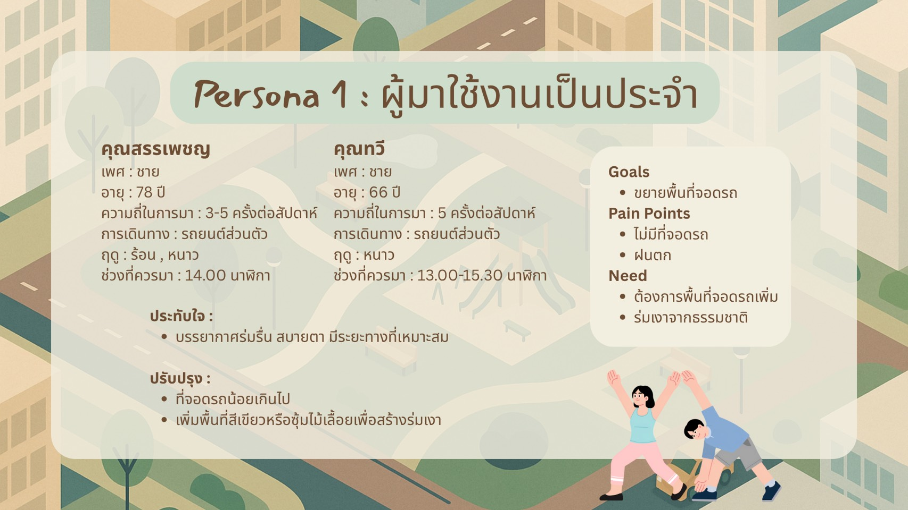
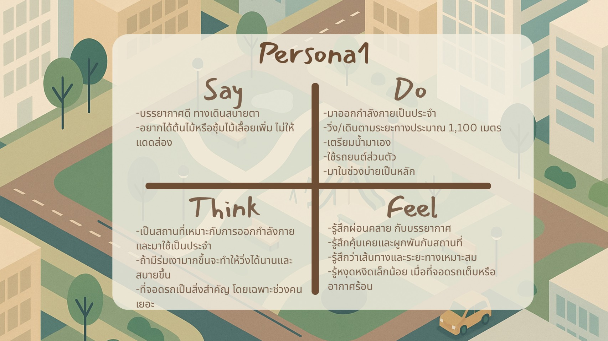
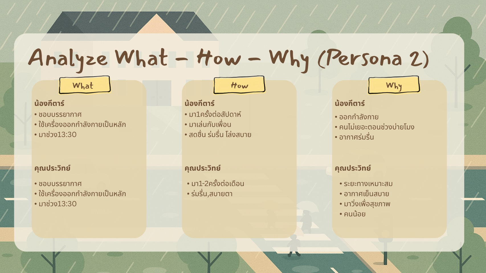
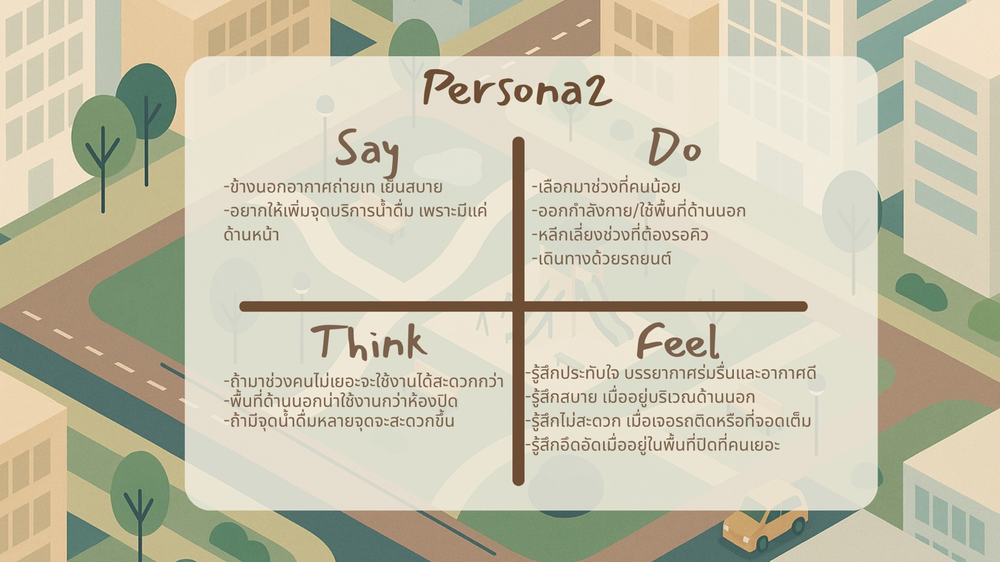
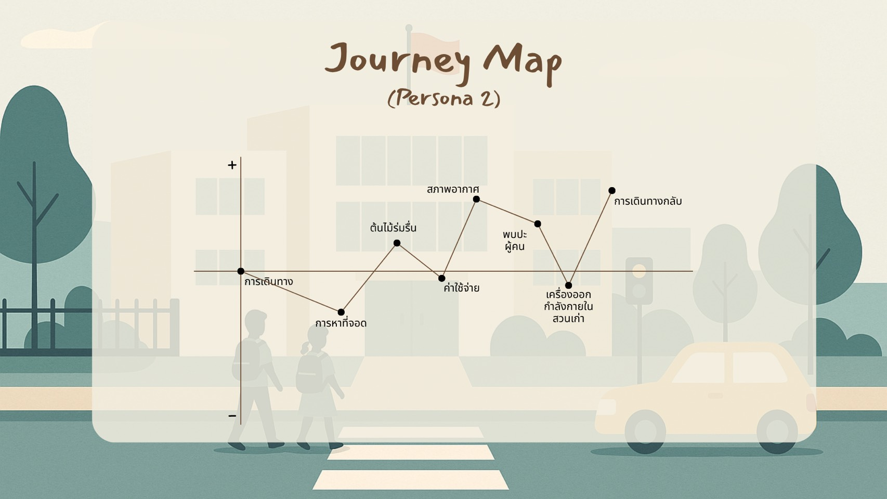
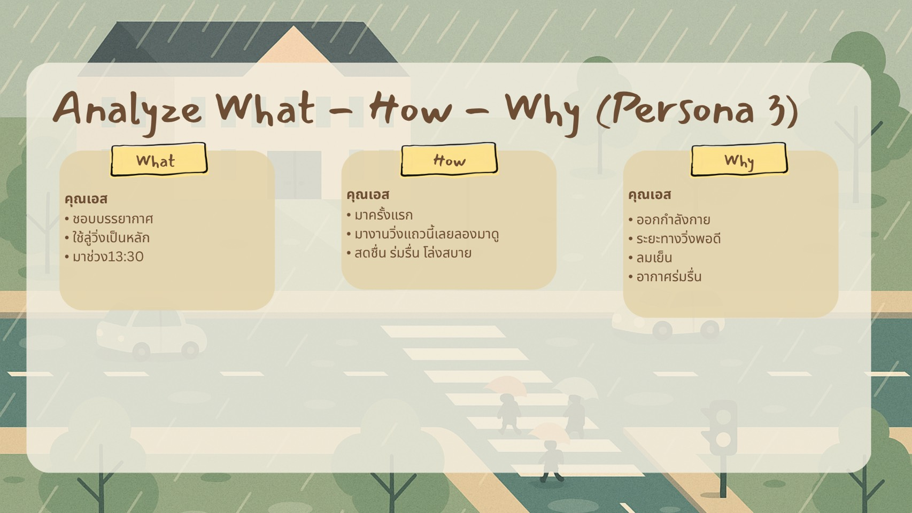
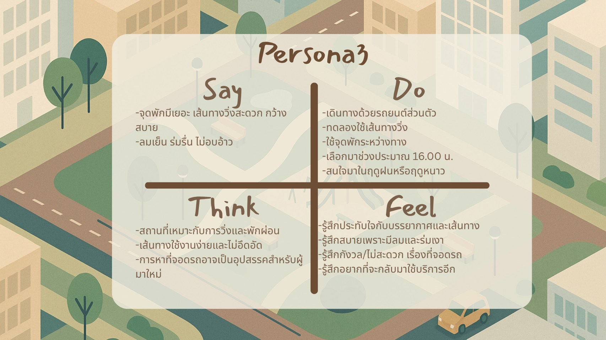
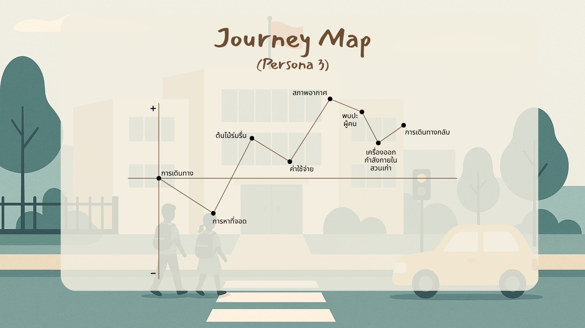
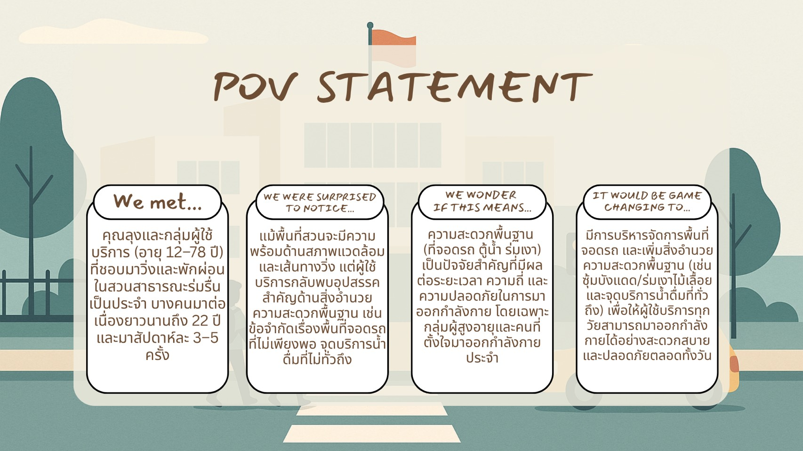

## 🎙️ INTERVIEW SCRIPT 🎙️

---

# 👤 คนที่ 1 (เอส)
- คุณชื่ออะไรครับ : เอส
- ตอนนี้อายุเท่าไหร่ครับ : 43
- ปกติเดินทางมาที่นี่บ่อยแค่ไหนครับ : พึ่งมาครั้งแรก
- เดินทางมาด้วยวิธีไหนครับ : ขับรถยนต์ส่วนตัว
- ชอบมาในฤดูไหนมากที่สุดครับ : ฝน , หนาว
- คิดว่าช่วงเวลาไหนที่ควรมามากที่สุดครับ : 16:00
- มีความประทับใจอะไรกับสถานที่นี้บ้างครับ : จุดพักมีเยอะ เส้นทางวิ่งสะดวกกว้างสบาย ลมเย็น ร่มรื่น ไม่อบอ้าว (วันนั้นไม่มีแดด)
- มีส่วนไหนที่อยากให้เราปรับปรุงหรือพัฒนาเพิ่มขึ้นไหมครับ : ที่จอดรถน้อย 

---

# 👤 คนที่ 2 (กีตาร์)
- คุณชื่ออะไรครับ : กีตาร์
- ตอนนี้อายุเท่าไหร่ครับ : 12
- ปกติเดินทางมาที่นี่บ่อยแค่ไหนครับ : มาสัปดาห์ละ 1 ครั้ง
- เดินทางมาด้วยวิธีไหนครับ : ลำบาก นั่งรถเมล์ 2 ต่อ ใช้ค่าใช้จ่ายประมาณ 40 บาท
- ชอบมาในฤดูไหนมากที่สุดครับ : ร้อน
- คิดว่าช่วงเวลาไหนที่ควรมามากที่สุดครับ : 12:00
- มีความประทับใจอะไรกับสถานที่นี้บ้างครับ : อากาศร่มรื่น ธรรมชาติสวย
- มีส่วนไหนที่อยากให้เราปรับปรุงหรือพัฒนาเพิ่มขึ้นไหมครับ : เครื่องออกกำลังกายเก่า

---

# 👤 คนที่ 3 (สรรเพชญ)
- คุณชื่ออะไรครับ : สรรเพชญ
- ตอนนี้อายุเท่าไหร่ครับ : 78
- ปกติเดินทางมาที่นี่บ่อยแค่ไหนครับ : 3-5 ครั้ง / สัปดาห์
- เดินทางมาด้วยวิธีไหนครับ : รถยนต์ส่วนตัว
- ชอบมาในฤดูไหนมากที่สุดครับ : หนาว, ร้อน
- คิดว่าช่วงเวลาไหนที่ควรมามากที่สุดครับ : 14.00
- มีความประทับใจอะไรกับสถานที่นี้บ้างครับ : ทางเดินเลี้ยวไปมา สบายตา
- มีส่วนไหนที่อยากให้เราปรับปรุงหรือพัฒนาเพิ่มขึ้นไหมครับ : ที่จอดรถน้อยไป

---

# 👤 คนที่ 4 (ทวี)
- คุณชื่ออะไรครับ : ทวี
- ตอนนี้อายุเท่าไหร่ครับ : 66
- ปกติเดินทางมาที่นี่บ่อยแค่ไหนครับ : สัปดาห์ละ 5 วัน
- เดินทางมาด้วยวิธีไหนครับ : รถยนต์ส่วนตัว
- ชอบมาในฤดูไหนมากที่สุดครับ : หนาว, ร้อน
- คิดว่าช่วงเวลาไหนที่ควรมามากที่สุดครับ : ก่อน 15.30
- มีความประทับใจอะไรกับสถานที่นี้บ้างครับ : บรรยากาศในสวน
- มีส่วนไหนที่อยากให้เราปรับปรุงหรือพัฒนาเพิ่มขึ้นไหมครับ : อยากได้ต้นไม้เยอะกว่านี้ หรือทำซุ้ม ไม้เลื้อย ไม่ให้แดดส่อง

---

# 👤 คนที่ 5 (ประวิทย์)
- คุณชื่ออะไรครับ : ประวิทย์
- ตอนนี้อายุเท่าไหร่ครับ : 36
- ปกติเดินทางมาที่นี่บ่อยแค่ไหนครับ : มาเดือนละ 1-2 ครั้ง
- เดินทางมาด้วยวิธีไหนครับ : รถยนต์ส่วนตัว
- ชอบมาในฤดูไหนมากที่สุดครับ : ร้อน
- คิดว่าช่วงเวลาไหนที่ควรมามากที่สุดครับ : 13.00-15.00
- มีความประทับใจอะไรกับสถานที่นี้บ้างครับ : บรรยากาศร่มรื่น อากาศดี
- มีส่วนไหนที่อยากให้เราปรับปรุงหรือพัฒนาเพิ่มขึ้นไหมครับ :  รถติด , ที่จอดน้อยและเต็ม, เพิ่มจุดบริการน้ำดื่มให้เยอะขึ้น มีแค่ด้านหน้า

---
# 🙍‍♂️ User Persona1 - Journey Map 🗺

---

# 🙍‍♂️ User Persona2 - Journey Map 🗺

---

# 🙍‍♂️ User Persona3 - Journey Map 🗺

---

# Insight 💭

## Insight จาก User 👤

- ### ผู้ใช้ต้องการพื้นที่ออกกำลังกายที่ร่มรื่น อากาศถ่ายเท และสบายตา
  จากการใช้งานของทั้งผู้ที่มาเป็นประจำ ผู้ที่มาเป็นครั้งคราว และผู้ที่มาเป็นครั้งแรก พบว่าผู้ใช้ประทับใจกับบรรยากาศของสวนที่มีลมเย็น ธรรมชาติสวย ร่มรื่น และเส้นทางเดินหรือวิ่งที่กว้างและสบาย จึงสะท้อนว่าสภาพแวดล้อมที่ไม่ร้อนและไม่อึดอัดเป็นปัจจัยสำคัญต่อประสบการณ์การใช้งาน
  
- ### ผู้ใช้ต้องการร่มเงาและการป้องกันความร้อนที่มากขึ้น
  ผู้ใช้บางส่วนต้องการให้เพิ่มต้นไม้หรือซุ้มไม้เลื้อยเพื่อช่วยบังแดด โดยเฉพาะในช่วงที่ต้องออกกำลังกายตอนกลางวัน แสดงให้เห็นว่าการเพิ่มพื้นที่ร่มเงาจะช่วยให้ผู้ใช้สามารถใช้งานสวนได้อย่างสบายมากขึ้นในหลายช่วงเวลา
  
- ### ผู้ใช้ต้องการสิ่งอำนวยความสะดวกที่เพียงพอระหว่างการใช้งาน
  ผู้ใช้มีการเตรียมน้ำมาเอง และมีข้อเสนอให้เพิ่มจุดบริการน้ำดื่ม เนื่องจากจุดบริการที่มีอยู่ยังไม่ครอบคลุมพื้นที่ทั้งหมด นอกจากนี้ยังพบความต้องการให้ปรับปรุงอุปกรณ์ออกกำลังกายที่เก่า แสดงให้เห็นว่าผู้ใช้คาดหวังให้สิ่งอำนวยความสะดวกมีความพร้อมและเพียงพอต่อการใช้งาน
  
- ### ผู้ใช้ให้ความสำคัญกับความสะดวกในการเดินทางและการจอดรถ
  ผู้ใช้หลายคนเดินทางด้วยรถยนต์ส่วนตัว และพบปัญหาที่จอดรถมีจำนวนน้อยหรือเต็ม รวมถึงปัญหารถติดบริเวณโดยรอบ จึงสะท้อนว่าการเดินทางและการมีพื้นที่จอดรถที่เพียงพอเป็นปัจจัยที่ส่งผลต่อความสะดวกในการมาใช้บริการ
  
- ### ผู้ใช้เลือกช่วงเวลาตามสภาพอากาศและความหนาแน่นของผู้คน
  ผู้ใช้แต่ละกลุ่มมีการเลือกช่วงเวลาที่แตกต่างกัน แต่มีแนวโน้มเลือกช่วงที่อากาศเหมาะสม เช่น ช่วงบ่ายหรือประมาณ 13.00 น. รวมถึงบางคนเลือกช่วงที่มีผู้ใช้งานไม่มาก เพื่อหลีกเลี่ยงความแออัดและสามารถออกกำลังกายได้อย่างสะดวก

---
# 🎈 POV 🎈

