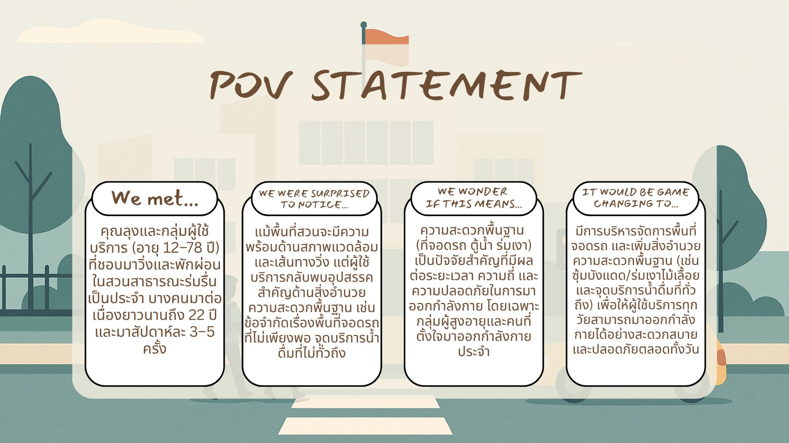

# 🎈 POV 🎈
## 👨🏾‍🤝‍👨🏻 We met…
- คุณลุงและกลุ่มผู้ใช้บริการ (อายุ 12–78 ปี) ที่ชอบมาวิ่งและพักผ่อนในสวนสาธารณะร่มรื่นเป็นประจำ บางคนมาต่อเนื่องยาวนานถึง 22 ปี และมาสัปดาห์ละ 3–5 ครั้ง

## 😯 We were surprised to notice…
 - แม้พื้นที่สวนจะมีความพร้อมด้านสภาพแวดล้อมและเส้นทางวิ่ง แต่ผู้ใช้บริการกลับพบอุปสรรคสำคัญด้านสิ่งอำนวยความสะดวกพื้นฐาน เช่น ข้อจำกัดเรื่องพื้นที่จอดรถที่ไม่เพียงพอ จุดบริการน้ำดื่มที่ไม่ทั่วถึง

## 🤨 We wonder if this means… 🤔
- ความสะดวกพื้นฐาน 
(ที่จอดรถ ตู้น้ำ ร่มเงา) เป็นปัจจัยสำคัญที่มีผลต่อระยะเวลา ความถี่ และความปลอดภัยในการมาออกกำลังกาย โดยเฉพาะกลุ่มผู้สูงอายุและคนที่ตั้งใจมาออกกำลังกายประจำ

## :rocket: It would be game changing to…
-  มีการบริหารจัดการพื้นที่จอดรถ และเพิ่มสิ่งอำนวยความสะดวกพื้นฐาน (เช่น ซุ้มบังแดด/ร่มเงาไม้เลื้อย และจุดบริการน้ำดื่มที่ทั่วถึง) เพื่อให้ผู้ใช้บริการทุกวัยสามารถมาออกกำลังกายได้อย่างสะดวกสบายและปลอดภัยตลอดทั้งวัน

