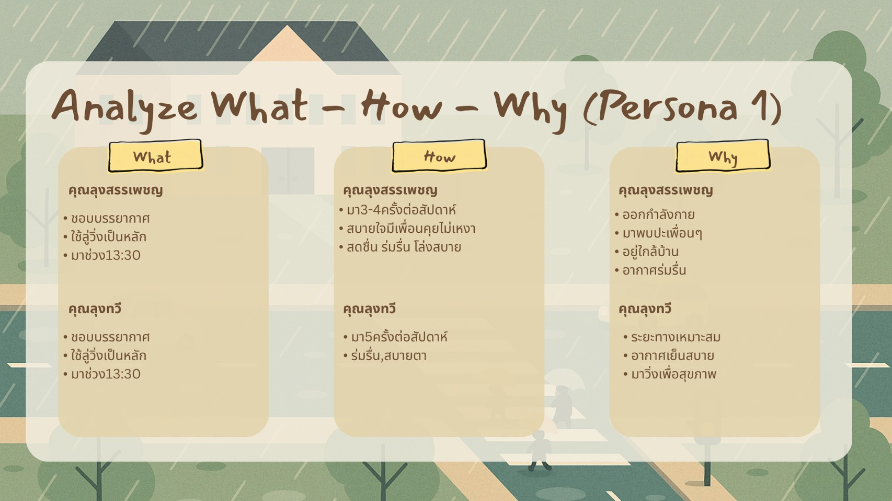
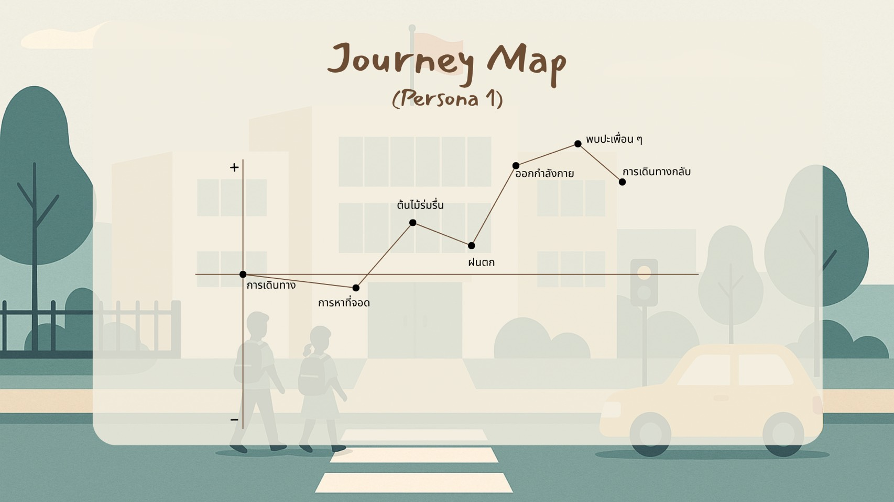
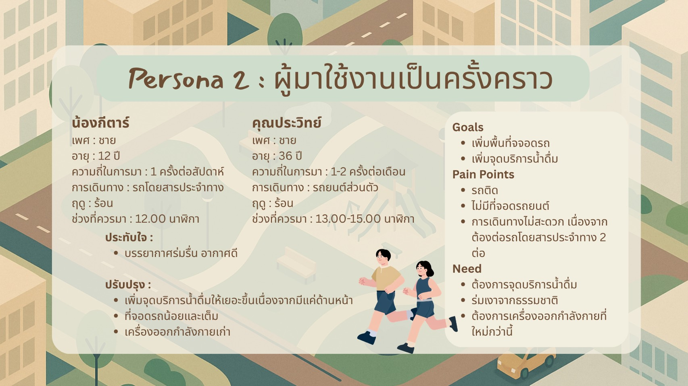
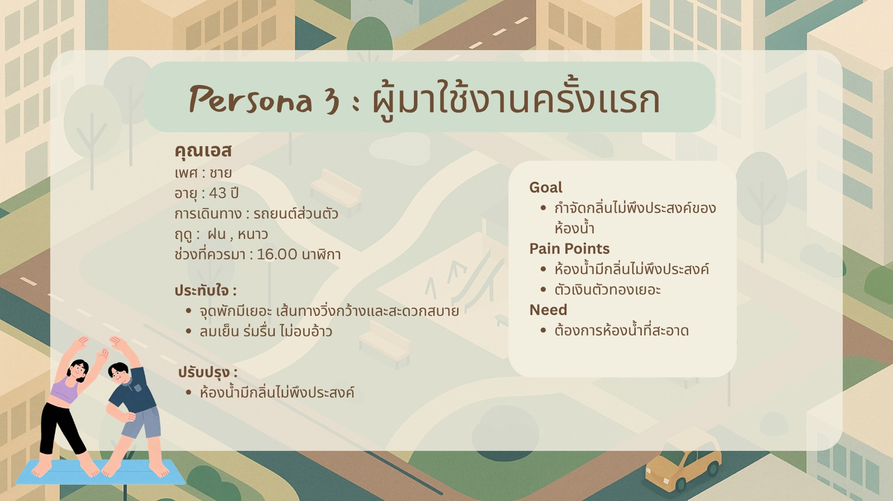

---
# 🙍‍♂️ User Persona1 - Journey Map 🗺

---

# 🙍‍♂️ User Persona2 - Journey Map 🗺

---

# 🙍‍♂️ User Persona3 - Journey Map 🗺

---

# Insight 💭

## Insight จาก User 👤

- ### ผู้ใช้ต้องการพื้นที่ออกกำลังกายที่ร่มรื่น อากาศถ่ายเท และสบายตา
  จากการใช้งานของทั้งผู้ที่มาเป็นประจำ ผู้ที่มาเป็นครั้งคราว และผู้ที่มาเป็นครั้งแรก พบว่าผู้ใช้ประทับใจกับบรรยากาศของสวนที่มีลมเย็น ธรรมชาติสวย ร่มรื่น และเส้นทางเดินหรือวิ่งที่กว้างและสบาย จึงสะท้อนว่าสภาพแวดล้อมที่ไม่ร้อนและไม่อึดอัดเป็นปัจจัยสำคัญต่อประสบการณ์การใช้งาน
  
- ### ผู้ใช้ต้องการร่มเงาและการป้องกันความร้อนที่มากขึ้น
  ผู้ใช้บางส่วนต้องการให้เพิ่มต้นไม้หรือซุ้มไม้เลื้อยเพื่อช่วยบังแดด โดยเฉพาะในช่วงที่ต้องออกกำลังกายตอนกลางวัน แสดงให้เห็นว่าการเพิ่มพื้นที่ร่มเงาจะช่วยให้ผู้ใช้สามารถใช้งานสวนได้อย่างสบายมากขึ้นในหลายช่วงเวลา
  
- ### ผู้ใช้ต้องการสิ่งอำนวยความสะดวกที่เพียงพอระหว่างการใช้งาน
  ผู้ใช้มีการเตรียมน้ำมาเอง และมีข้อเสนอให้เพิ่มจุดบริการน้ำดื่ม เนื่องจากจุดบริการที่มีอยู่ยังไม่ครอบคลุมพื้นที่ทั้งหมด นอกจากนี้ยังพบความต้องการให้ปรับปรุงอุปกรณ์ออกกำลังกายที่เก่า แสดงให้เห็นว่าผู้ใช้คาดหวังให้สิ่งอำนวยความสะดวกมีความพร้อมและเพียงพอต่อการใช้งาน
  
- ### ผู้ใช้ให้ความสำคัญกับความสะดวกในการเดินทางและการจอดรถ
  ผู้ใช้หลายคนเดินทางด้วยรถยนต์ส่วนตัว และพบปัญหาที่จอดรถมีจำนวนน้อยหรือเต็ม รวมถึงปัญหารถติดบริเวณโดยรอบ จึงสะท้อนว่าการเดินทางและการมีพื้นที่จอดรถที่เพียงพอเป็นปัจจัยที่ส่งผลต่อความสะดวกในการมาใช้บริการ
  
- ### ผู้ใช้เลือกช่วงเวลาตามสภาพอากาศและความหนาแน่นของผู้คน
  ผู้ใช้แต่ละกลุ่มมีการเลือกช่วงเวลาที่แตกต่างกัน แต่มีแนวโน้มเลือกช่วงที่อากาศเหมาะสม เช่น ช่วงบ่ายหรือประมาณ 13.00 น. รวมถึงบางคนเลือกช่วงที่มีผู้ใช้งานไม่มาก เพื่อหลีกเลี่ยงความแออัดและสามารถออกกำลังกายได้อย่างสะดวก

---
# POV
! 

